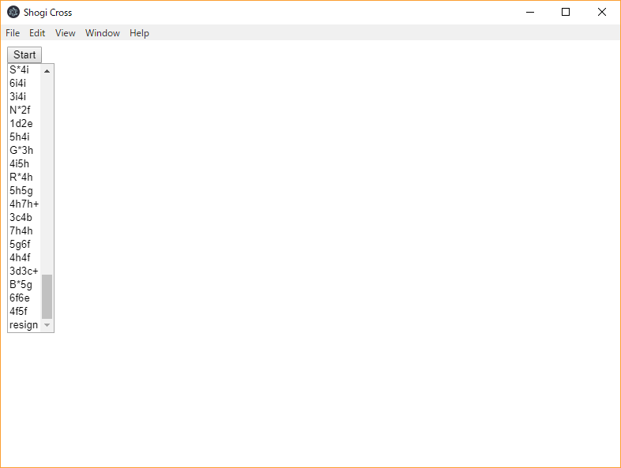

# Shogi Cross
Cross-platform GUI for Shogi AI

USIプロトコル対応のコンピュータ将棋エンジンを動作させるためのGUIです。
[electron](https://electronjs.org/)の利用によりクロスプラットフォームな実装を目指しています。

まだ実用性はありません。



# 環境構築
```
git clone https://github.com/select766/shogi-cross
cd shogi-cross
npm install
```

サンプルエンジンとして、`Engine`ディレクトリに`Lesserkai.exe`および付属ファイルを置く。(将棋所に付属しているものを移動する等)

# ビルド
TypeScriptで実装しているためコンパイルが必要です。

```
npm run build
```

# 実行
```
npm start
```

# Windows実行ファイル作成
```
npm run package:win
```

`out\shogi-cross-win32-ia32`を配布。
